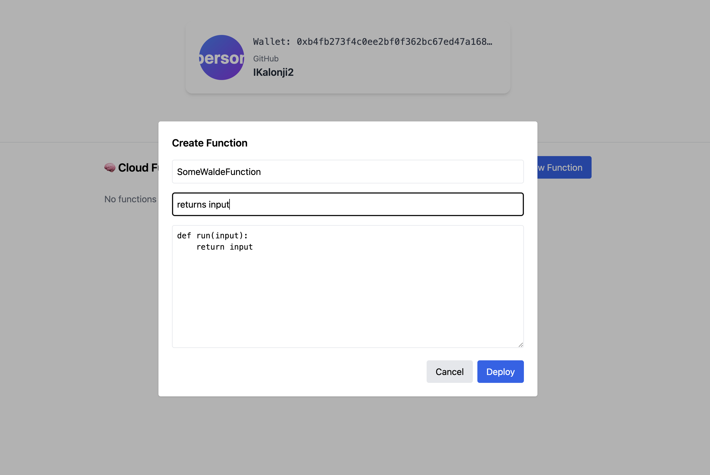

# 🌐 Walde: Zero-Config Web3 Deployments on Sui & Walrus

**Walde** is a public-good infrastructure platform that lets developers deploy static websites and Python cloud functions directly to the Sui blockchain — using GitHub and a wallet.

- 🔐 Wallet + GitHub login (no passwords)
- ⚡ Auto-deploy from GitHub repo on push
- 🧱 Sites live forever on-chain via Walrus
- 🧠 Cloud Functions run via API with no servers

> **Live App:** [https://app.walde.cloud](https://app.walde.cloud)  
> **Demo Video:** 📺 [[YouTube demo](https://youtu.be/09zBjlYg4QE)]

---

## 🖼 Screenshots

| Dashboard View | Build Logs |
|----------------|------------|
|  |  |

| Functions List | Create Function Modal |
|----------------|------------------------|
|  |  |

---

## 🔧 How To Use Walde ([https://app.walde.cloud](https://app.walde.cloud))

FORK THE TEST SITE REPO HERE (https://github.com/IKalonji2/demo-walde-site) TO TEST WEBSITE DEPLOYMENT FUNCTIONALITY

### 🚀 Deploy a Site from GitHub

1. Connect your Sui wallet (e.g. Sui Wallet, Ethos).
2. Click **"Connect GitHub"** and authorize the Walde GitHub App.
3. On the dashboard, click **"Create New"**.
4. Select:
   - **Repository**
   - **Branch**
   - **Build command** (e.g. `npm run build`)
   - **Output directory** (e.g. `/dist/demo-walde-site/browser`)
5. Click **"Start Build"**.
6. Once deployed, get your **permanent Walrus-hosted site URL**.

### 🧠 Create and Invoke Cloud Functions

1. Go to the **"Functions"** tab in the dashboard.
2. Click **"New Function"** and paste a Python function:
    ```python
    def run(input):
        return input.upper()
    ```
3. Deploy → get a public URL like:
    ```
    https://functions.walde.cloud/functions/abc-123/invoke
    ```
4. Send a `POST` to that URL with JSON input like:
    ```json
    { "input": "hello" }
    ```
   and receive a result like `"HELLO"`.

---

## 📈 Use Case

> **Walde makes Web3-native deployments simple** for frontend and backend developers — permanently hosted, Sui-authenticated, GitHub-connected, and zero-infra.

Use cases include:

- Web3 frontend deployments
- Trustless dashboards / DAOs
- Lightweight agent/AI function APIs
- On-chain, verifiable tools or public resources
- Zero-trust development workflows

---

## ⚙️ Architecture

### 🧠 Cloud Function Execution


### 🌍 Static Site Deployment Flow


## ✨ Future Features
| Feature                  | Description                                        |
| ------------------------ | -------------------------------------------------- |
| 🪄 Function state + auth | Enable private or stateful cloud functions         |
| 🧠 AI Agents             | Deploy lightweight Python agents w/ prompt logic   |
| 💽 Static storage        | Upload files (e.g. JSON configs, assets) to Walrus |
| 📊 Usage logs            | Show function call counts, duration, last run      |
| 🔐 Signed invocation     | Let users sign API calls from client side          |

## 💰 Business Model / Public Good?
Walde is intentionally designed as a public-good infrastructure project for the Sui and Walrus ecosystem.

🟢 Fully open-source

🌍 Promotes verifiable, censorship-resistant publishing

🔐 Uses Sui-native auth — no passwords or Web2 auth

🛠 Self-hostable, no third-party vendor lock-in

This helps foster a trustless, decentralized development environment that benefits the ecosystem and developer community directly.

## 💡 Project Checklist Mapping
| Criteria                | Walde Delivers ✅                   |
| ----------------------- | ---------------------------------- |
| **Original Concept**    | GitHub + Sui + Walrus = unique UX  |
| **Real-world use case** | Static apps, microservice APIs     |
| **Working product**     | Fully functional, live MVP         |
| **Clean UI/UX**         | Angular frontend, tabbed UX        |
| **Technical Depth**     | CLI integration, blob execution    |
| **Sui Integration**     | Wallet auth, object permanence     |
| **Walrus Usage**        | On-chain deployment via blob/store |
| **"Wow" factor**        | One-click Python API from a wallet |

## 🎥 Demo Video
📺 YouTube Demo:
https://youtube.com/watch?v=09zBjlYg4QE

## 🤝 Built With
💻 Angular + Tailwind (UI)

🐍 Flask + Celery + Redis (Backend)

📦 Walrus Protocol (Deployment)

🔗 Sui Wallet Auth

🐙 GitHub OAuth

🧪 SQLite + SQLAlchemy